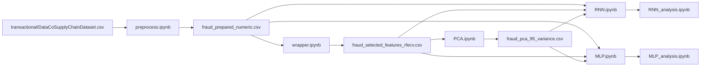

# Fraud Detection in DataCo Smart Supply Chain

This repository explores fraud detection on transactional supply chain data using two deep learning approaches:

- **RNN-based model** (implemented with stacked **GRU** layers)
- **MLP** (Multi-Layer Perceptron)

Both models are trained and compared on **three feature representations**:

1. **Preprocessed numeric dataset**
2. **Feature-selected dataset** using a **wrapper method**
3. **Feature-extracted dataset** using **PCA**

The goal is to study how preprocessing, feature selection, and feature extraction affect fraud detection performance on the same underlying transactional data.

---

## Data Source and Reference

- **Dataset:** [DataCo Smart Supply Chain for Big Data Analysis](https://www.kaggle.com/datasets/shashwatwork/dataco-smart-supply-chain-for-big-data-analysis)
- **Research reference:** [Enhancing Supply Chain Management: A Comparative Analysis of XGBoost and RNN for Demand Forecasting and Route Optimization](https://www.mdpi.com/2071-1050/17/13/5772)

> The dataset provides the raw transactional records used in this project.  
> The paper is used as a research reference and motivation for the broader supply-chain machine learning context.

---

## Project Objective

The raw dataset is transactional and contains a mixture of identifiers, categorical variables, dates, text-like fields, and other operational attributes.  
To make it suitable for machine learning, the workflow:

- engineers a fraud target from transaction status,
- removes leakage, identifiers, and irrelevant columns,
- converts the data into a numeric modeling table,
- creates alternative feature spaces,
- trains two neural-network models on each feature space,
- compares the resulting performance.

---

## End-to-End Pipeline



---

## Workflow Details

### 1) Preprocessing and Data Engineering

The preprocessing stage transforms the raw transactional dataset into a machine-learning-ready format.

Main steps:

- Create the binary target variable:
  - `fraud = 1` when `Order Status == SUSPECTED_FRAUD`
- Remove obvious:
  - leakage / post-outcome variables
  - identifiers and operational keys
  - personally identifiable or low-generalization columns
  - duplicate, constant, and fully missing columns
- Perform **date feature engineering** from `order date (DateOrders)`:
  - year, quarter, month, day, weekday, hour, weekend flag
- Handle missing values:
  - median imputation for numeric columns
  - `"Unknown"` fill for categorical columns
- Convert data to numeric form:
  - **one-hot encoding** for low-cardinality categorical variables
  - **frequency encoding** for high-cardinality categorical variables

Generated outputs in `fraud_preprocessing/`:

- `fraud_prepared_base.csv`
- `fraud_prepared_numeric.csv`
- `fraud_original_column_audit.csv`
- `fraud_feature_manifest.csv`
- `fraud_preprocessing_summary.csv`
- `fraud_dropped_columns.csv`
- `fraud_encoding_log.csv`

---

### 2) Wrapper-Based Feature Selection

The wrapper stage creates a reduced dataset from the numeric table.

Implementation details:

- **Package / module:** `sklearn.feature_selection.RFECV`
- **Base estimator:** `sklearn.linear_model.LogisticRegression`
- **Cross-validation:** `sklearn.model_selection.StratifiedKFold`
- **Preprocessing inside pipeline:** `sklearn.compose.ColumnTransformer` + `sklearn.preprocessing.StandardScaler`
- **Pipeline:** `sklearn.pipeline.Pipeline`

Configuration used in the notebook:

- `class_weight="balanced"`
- `solver="liblinear"`
- `max_iter=2000`
- `n_splits=5`
- `scoring="average_precision"`
- `step=2`
- `min_features_to_select=5`

Output:

- `wrapper/fraud_selected_features_rfecv.csv`

Why this step matters:

- it reduces feature dimensionality,
- removes weaker variables,
- keeps a more compact feature set for downstream training.

---

### 3) Feature Extraction with PCA

After wrapper-based selection, the project applies **Principal Component Analysis (PCA)** to build a compressed feature space.

Implementation details:

- **Package / module:** `sklearn.decomposition.PCA`
- **Scaling before PCA:** `sklearn.preprocessing.StandardScaler`
- **Retention rule:** `n_components=0.95`

This keeps enough principal components to explain **95% of the variance**.

Generated outputs in `PCA/`:

- `fraud_pca_95_variance.csv`
- `fraud_pca_loadings.csv`

---

### 4) Model Training

Both deep learning models are trained on the following three datasets:

1. `fraud_prepared_numeric.csv`
2. `fraud_selected_features_rfecv.csv`
3. `fraud_pca_95_variance.csv`

#### MLP model

The MLP notebook uses a feedforward neural network with:

- Dense(128, ReLU)
- BatchNormalization
- Dropout(0.3)
- Dense(64, ReLU)
- BatchNormalization
- Dropout(0.3)
- Dense(32, ReLU)
- Dropout(0.2)
- Dense(1, Sigmoid)

#### RNN model

The RNN notebook is implemented with **GRU layers** over reshaped tabular input:

- GRU(64, return_sequences=True)
- Dropout(0.2)
- GRU(32)
- Dropout(0.2)
- Dense(32, ReLU)
- Dropout(0.3)
- Dense(1, Sigmoid)

#### Shared training strategy

Both notebooks use:

- `train / validation / test` splitting
- `StandardScaler`
- class weights for imbalance handling
- `Adam(learning_rate=1e-3)`
- `binary_crossentropy`
- metrics:
  - accuracy
  - precision
  - recall
  - F1-score
  - ROC-AUC
  - PR-AUC
- `EarlyStopping` monitored on validation PR-AUC
- `ReduceLROnPlateau`
- validation-based threshold tuning for the final binary decision

---

## Repository Structure

```text
Machine-Learning/
│
├── transactional/
│   ├── DataCoSupplyChainDataset.csv
│   ├── DescriptionDataCoSupplyChain.csv
│   └── tokenized_access_logs.csv
│
├── fraud_preprocessing/
│   ├── fraud_prepared_base.csv
│   ├── fraud_prepared_numeric.csv
│   ├── fraud_original_column_audit.csv
│   ├── fraud_feature_manifest.csv
│   ├── fraud_preprocessing_summary.csv
│   ├── fraud_dropped_columns.csv
│   └── fraud_encoding_log.csv
│
├── wrapper/
│   └── fraud_selected_features_rfecv.csv
│
├── PCA/
│   ├── fraud_pca_95_variance.csv
│   └── fraud_pca_loadings.csv
│
├── model/
│   ├── MLP/
│   │   ├── csv/
│   │   ├── figure/
│   │   └── *.keras
│   └── RNN/
│       ├── csv/
│       ├── figure/
│       └── *.keras
│
├── notebook/
│   ├── preprocess.ipynb
│   ├── wrapper.ipynb
│   ├── PCA.ipynb
│   ├── RNN.ipynb
│   ├── MLP.ipynb
│   ├── RNN_analysis.ipynb
│   └── MLP_analysis.ipynb
│
├── main.py
└── README.md
```

---

## Installation

It is recommended to create a virtual environment first.

### Create and activate a virtual environment

```bash
python -m venv .venv
```

**Windows**
```bash
.venv\Scripts\activate
```

**macOS / Linux**
```bash
source .venv/bin/activate
```

### Install required packages

```bash
pip install numpy pandas scikit-learn tensorflow matplotlib nbformat nbclient ipykernel
```

### Optional: install Jupyter notebook support

```bash
pip install notebook
```

---

## How to Run

### Option 1 — Run the full pipeline automatically

From the repository root:

```bash
python main.py
```

`main.py` executes the notebooks in this order:

1. `notebook/preprocess.ipynb`
2. `notebook/wrapper.ipynb`
3. `notebook/PCA.ipynb`
4. `notebook/RNN.ipynb`
5. `notebook/MLP.ipynb`
6. `notebook/RNN_analysis.ipynb`
7. `notebook/MLP_analysis.ipynb`

This is the easiest way to reproduce the full workflow end to end.

---

### Option 2 — Run notebooks manually

Open the notebooks in order and execute them one by one:

1. `preprocess.ipynb`
2. `wrapper.ipynb`
3. `PCA.ipynb`
4. `RNN.ipynb`
5. `MLP.ipynb`
6. `RNN_analysis.ipynb`
7. `MLP_analysis.ipynb`

Recommended order is important because later notebooks depend on files produced by earlier ones.

---

## Outputs

### Preprocessing outputs
Saved to `fraud_preprocessing/`:
- cleaned base dataset
- numeric-ready dataset
- audit and summary files
- encoding and dropped-column logs

### Feature engineering outputs
Saved to:
- `wrapper/fraud_selected_features_rfecv.csv`
- `PCA/fraud_pca_95_variance.csv`
- `PCA/fraud_pca_loadings.csv`

### Model outputs
Saved to `model/MLP/` and `model/RNN/`:
- trained `.keras` models
- training history CSV files
- test prediction CSV files
- comparison result CSV files
- analysis figures

---

## Evaluation

The project compares both models across all three dataset representations using:

- Accuracy
- Precision
- Recall
- F1-score
- ROC-AUC
- PR-AUC
- Confusion matrix
- ROC curves
- Precision-Recall curves

Because fraud detection is typically imbalanced, **PR-AUC**, **recall**, and threshold tuning are especially important in this project.

---

## Notes

- The preprocessing notebook is designed specifically for the fraud-label construction used in this repository.
- The wrapper method is based on **RFECV**, which automatically searches for a strong subset of features through recursive elimination with cross-validation.
- The feature extraction stage uses **PCA** to compress the selected feature space while preserving most variance.
- The current "RNN" implementation uses **GRU layers**, which are a gated recurrent architecture within the recurrent neural network family.

---

## Future Improvements

Possible extensions for this repository:

- add a `requirements.txt`
- add experiment tracking
- add hyperparameter tuning
- compare against classical baselines such as Logistic Regression, Random Forest, or XGBoost
- document final benchmark results in a dedicated results section

---

## Citation / Acknowledgement

If you use this repository, please also acknowledge the original data source and the research paper that inspired the problem context.

- Kaggle dataset: DataCo Smart Supply Chain for Big Data Analysis
- MDPI paper: *Enhancing Supply Chain Management: A Comparative Analysis of XGBoost and RNN for Demand Forecasting and Route Optimization*